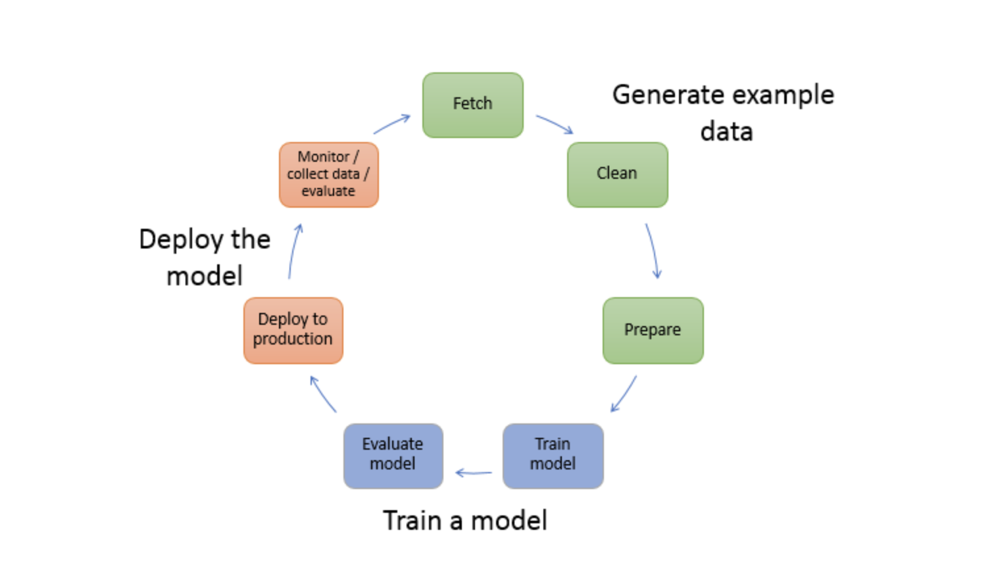

# sagemaker:
------------
* Amazon SageMaker is a fully managed machine learning (ML) service. With SageMaker, data scientists and developers can quickly and confidently build, train, and deploy ML models into a production-ready hosted environment.
* You can use Python and R natively in Amazon SageMaker notebook kernels. There are also kernels that support specific frameworks. A very popular way to get started with SageMaker is to use the Amazon SageMaker Python SDK .
* SageMaker Studio is an integrated development environment (IDE) for ML that provides a fully managed Jupyter notebook interface in which you can perform end-to-end ML lifecycle tasks, including model deployment.

[Sagemaker Pricing](https://aws.amazon.com/sagemaker/pricing/)

### Overview of machine learning with Amazon SageMaker:
-------------------------------------------------------
* In machine learning, we teach the computer to make predictions or inferences. First, we use an algorithm and an example data to train a model. Then we need to integrate our model into the application to generate inferences(giving an idea from the details) in real time and at scale.

* The following diagram illustrates the typical workflow for creating a machine learning model

    1. Generate example data:
    -------------------------
    * To train a model, you need example data. The type of data that you need depends on the business problem that you want the model to solve (the inferences that you want the model to generate). For example, suppose that you want to create a model to predict a number from an input image of a handwritten digit. To train such a model, you need example images of handwritten numbers.
    * Data scientists often devote time exploring and preprocessing example data before using it for model training. To preprocess data, you typically do the following:

        * Fetch the data:
        ------------------
            *   You might have in-house example data repositories, or you might use datasets that are publicly available. Typically, you pull the dataset or datasets into a single repository.

        * Clean the data:
        -----------------
            * To improve model training, inspect the data and clean it, as needed. For example, if your data has a country name attribute with values United States and US, you can edit the data to be consistent.

        * Prepare or transform the data:
        --------------------------------
            * To improve performance, you might perform additional data transformations. For example, you might choose to combine attributes. If your model predicts the conditions that require de-icing an aircraft, instead of using temperature and humidity attributes separately, you can combine those attributes into a new attribute to get a better model.

    * In SageMaker, you can preprocess example data using SageMaker APIs with the SageMaker Python SDK in an integrated development environment (IDE). With SDK for Python (Boto3) you can fetch, explore, and prepare your data for model training.

    2. Train a model:
    -----------------
    * Model training includes both training and evaluating the model, as follows:

        * Training the model:
        ---------------------
            * To train a model, you need an algorithm or a pre-trained base model. The algorithm you choose depends on a number of factors. For a built-in solution, you can use one of the algorithms that SageMaker provides. For a list of algorithms provided by SageMaker and related considerations. For a UI-based training solution that provides algorithms and models, see SageMaker JumpStart.

            * You also need compute resources for training. Depending on the size of your training dataset and how quickly you need the results, you can use resources ranging from a single general-purpose instance to a distributed cluster of GPU instances.

        * Evaluating the model:
        -----------------------
            * After you train your model, you evaluate it to determine whether the accuracy of the inferences is acceptable. To train and evaluate your model you can use the SageMaker Python SDK to send requests to the model for inferences through one of the available IDEs.

    3. Deploy the model:
    --------------------
    * You traditionally re-engineer a model before you integrate it with your application and deploy it. With SageMaker hosting services, you can deploy your model independently, which decouples it from your application code.

* Machine learning is a continuous cycle. After deploying a model, you monitor the inferences, collect more high-quality data, and evaluate the model to identify drift. You then increase the accuracy of your inferences by updating your training data to include the newly collected high-quality data. As more example data becomes available, you continue retraining your model to increase accuracy.